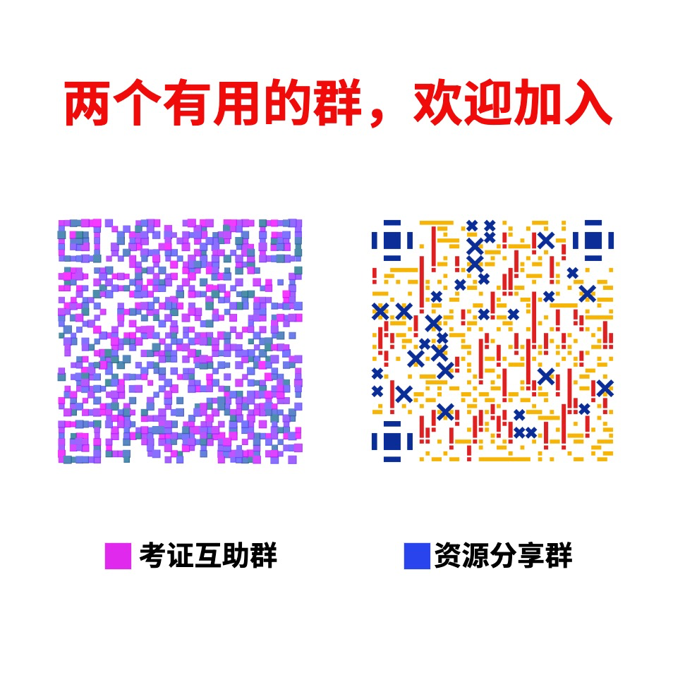

# 首页

大家好，我是`追马`，AICG践行者，在工作中会经常接触到 **ChatGPT** 和 **Midjourney** 等相关的工具。所以就想把工作中的一些内容给记录下来，然后形成一个简单有效的教程，在这个教程中，我会演示我日常工作中是如何使用 **ChatGPT** 和 **Midjourney**,  同时也会介绍不同类型的AI产品、各种常用的Prompt技巧、实际案例和经验分享等内容，帮助读者更好地掌握AI技能和应用，以此推动AI技术在不同领域的发展，为我们的未来带来更多的可能性。

### 课程内容

- 首先，我希望能够汇总并产出更加易懂的prompt方法，帮助大家更好地学习和应用这一技术。
- 其次，我课程会有大量的实操案例，让大家能够在整个完整对话期间掌握跟机器对话的思维和能力。
- 再者，我开发了每日快讯模块。在学习课程的同时，你还可以第一时间看到汇总好的AI新闻。
- 最后，我还会推荐一些更新快性能好的实用工具和最新论文，让大家能够更好地了解这一领域的最新进展。

我们相信，通过这些内容的学习，大家将能够更好地应用prompt技术，提高工作效率，创造更多的价值。

作为一个日常工作总结的教程，我希望大家在学习的过程中能够享受到学习的乐趣，同时也能够提高自己的能力。最重要的是，我希望能够及时听取大家的反馈和意见，以便更好地完善课程，同时也能够快速迭代和更新内容。作为一个开源课程，我希望能够与大家一起合作，共同打造出一个实用而全面的教程。

### 章节

每章对应的内容如下:

**快讯**：及时了解 ChatGPT、Midjourney 等AI产品的最新发展

**😄 Prompt 基础篇**: 介绍prompt基本概念和使用方法

**📝 ChatGPT 精选案例**: 提供prompt在垂直领域的应用案例

**💪 Prompt 高级技巧**: 提供实用的模板和技巧

**🎨 Midjourney 图片生成**: Midjourney文生图工具的基本使用

**🤖 Midjourney Prompt**: 详解Midjourney Prompt的提示语模板和提示自动生成

**🌟 Midjourney案例**: 提供Midjourney在不同的场景的应用案例

**🎥 Runway 视频生成**: 搭配ChatGPT+Midjourney的Runway视频生成

**🔍 工具推荐**: 最新的 ChatGPT、Midjourney、Runway等AIGC相关工具

**💡 资源推荐**: 最新的 ChatGPT、Midjourney、Runway等AIGC相关资源和学习资料

### 如何使用本教程

无需严格按照顺序阅读，我们已经精心分好了各个章节。大家可以自由探索感兴趣的主题。

如果你是新手，我们建议你从基础篇开始学习。这些章节会为你提供必要的知识和技能，以便更好地理解后续的内容。对于那些已经熟悉这些概念的人来说，精选案例是一个潜心研究和扩展知识的好地方，你可以在这里深入探讨相关的话题，拓展你的知识面。无论你的学习水平如何，我们的教程都会提供有益的信息和资源，帮助你更好地了解人工智能和机器学习的世界。

## 加入我们

欢迎来到「 AI时代掘金计划 」!
AI时代掘金计划是一个中文AIGC学习社区，我们的开源课程 <https://wiki.techrk1688.eu.org//> 现已经支持ChatGPT，Midjourney两大热门项目。同时我们的网站中会不定时更新更多实用的使用技巧，好用不割韭菜的各类工具推荐及使用教学，后期我们还会更新AI相关的科普知识和自己动手做GPT Api应用。各位在浏览我们网站的过程中有什么意见，遇到什么bug，可以在这里提出，也欢迎大家在这里交流AIGC未来各个场景落地的想法。

感谢大家对我们内容的认可！可以直接通过下方二维码进入（群内推送保持同步，大家可以自由选择）：

相信我们可以一起构造出更好的内容。你可以选择加入我们，成为课程开发的一员😄！
